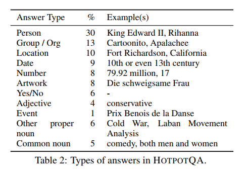

# Ko_HotpotQA

멀티홉 질의응답 데이터 세트
멀티홉 질의응답 데이터가 필요한 이유는 모든 질문들이 하나의 짧은 질문과 대답으로 이루어지지 않기 때문이다.
즉 하나의 문장 또는 단락 안에 여러가지 질문이 복합적으로 들어 있는 경우에 이를 해결하기 위하여 다양한 소스로부터 정답을 끌어와야 할 수 있다.
따라서 HotpotQA는 시스템이 답변에 도달하기 위해 둘 이상의 문서에서 가져온 정보를 가지고 추론해야 하는 멀티홉 리소싱을 수행하는 질의응답 시스템 성능 테스트를 위한 데이터 세트를 구축했다는데 의의가 있다.

데이터 구축 과정
  - 위키피디아 하이퍼링크 그래프를 통해 후보 단락 쌍 생성    
  - 답변에 도달하기 위해 가져온 둘 이상의 문서간의 관계에 따라 다음과 같이 멀티홉의 세분 내용 구분   
```
Input 질문을 WH-Question과 Yes/No-Question으로 나눔
while not finished do
     if random()  <  r1   then
          엔티티 b ∈ B를 균일하게 샘플링
          edge (a, b)를 균일하게 샘플링
          작업자가 단락 a및 b 에 대해 질문 생성
     else
          목록 크기에 따라 가중치를 부여한 확률로 L에서 목록을 샘플링
          목록에서 두 개체(a, b)를 균일하게 샘플링
          if random()  <  r2   then
                 작업자는 예/아니요 질문을 통해 a와 b 를 비교
          else
                작업자가 스팬 답변이  포함된 질문을 통해 A와 B를 비교
          end if
     end if
          작업자가 근거가 되는 사실을 규정
end whild
```

추론 유형 
1. 엔터티 사이에 다리가 되는 엔터티(브릿지 엔터티(bridge entity) 라 부름)가 있는 경우       
A : 2015 년 다이아몬드 헤드 클래식은 대학 농구 토너먼트다 ... 버디 힐드가 대회 MVP로 선정되었다.    
B: 차바노 레이니어 "버디" 힐드는 바하마의 프로농구 새크라멘토 킹스 소속 선수이다.    
Q: 2015 다이아몬드 헤드 클래식의 MVP로 선정된 선수는 어느 팀에서 뛰는가?    
   
2. 두 개의 엔티티(비교)          
A: 로스트얼론은 영국의 록 밴드로 ... 스티븐 바텔, 앨런, 윌리엄슨, 마크 깁슨...으로 구성되었다.    
B: 거스터는 미국의 얼터너티브 록 밴드로 ... 창립 멤버인 아담 가드너, 라이언 밀러, 브라이언 로젠워셀은...    
Q: 로스트얼론과 거스터의 멤버 구성원은 동수로 이루어져 있는가?    

3. 답이 되는 엔터티의 복합 속성을 탐색해야 하는 경우(유형 II)    
A: 피츠버그 파이어리츠의 현직 및 전직 멤버 몇 명은 ... 존 밀너, 데이브 파커, 로드 스커리...   
B: "코브라"라는 별명을 가진 데이비드 진 파커는 미국의 메이저리그 야구 출신의 선수다.    
Q: 피츠버그 파이리츠의 전 멤버 중 '코브라'라는 별명을 가진 선수는 누구인가?   
   

4. 브릿지 엔터티를 통해 질문에 있는 엔터티의 속성을 추론해야 하는 경우 (유형 III)    
A: 해병 전술 항공 사령부 제28 비행대대는 미 해병대이다. 해병대 항공 기지 체리 포인트에 위치한 항공 지휘 및 통제 유닛에 속한다....   
 B: 해병대 항공 기지 체리 포인트는 ... 미국 노스캐롤라이나 주 해브록에 위치한 미국 해병대 비행장이다.   
Q: 해병대 항공통제단 28은 어느 도시에 위치해 있는가?    
      
5. 두 가지 이상의 사실로 이루어져 있기 때문에 두 개 이상의 근거가 필요한 서로 다른 유형의 추론 (기타)    
A : ... 요도바시, 오쿠보, 도츠카, 오치 아이 마을이 요도바시 구로 통합되었다. ... 요도바시 카메라는 마을 이름을 딴 상점이다.    
B:  주식회사 요도바시 카메라는  전자제품, PC, 카메라 및 사진 장비를 전문으로 취급하는 일본의 주요 소매 체인점이다.    
Q: 요도바시 외에 어떤 구에 통합되어 주요한 구가 된 곳은 어디인가? 전자제품, PC, 카메라, 사진기기를 전문으로 취급하는 일본의 소매 체인점 이름은 무엇인가?    


  
# 응답 유형      



# 번역 데이터 예시       
| input | output |
| --- | --- |
| 슬로우 터닝은 싱어송라이터 존 하이앗의 아홉 번째 앨범으로 1988년에 발매되었습니다. 이 앨범은 타이틀 트랙으로 하이엇의 유일한 주요 라디오 히트곡을 제공했으며, "뒷좌석에 있는 아이들에게 소리를 지르고 있어요, 찰리 왓츠처럼 쾅쾅거리고 있거든요"라는 인상적인 가사가 담겨 있습니다. 싱글 "슬로우 터닝"은 데니스 퀘이드가 주연한 2002년 영화 드라마 "더 루키"에도 수록되었습니다. "필스 라이크 레인"은 나중에 버디 가이가 같은 제목의 앨범에서 커버했고, 2004년 케이트 허드슨이 출연한 영화 "라이징 헬렌"에 수록되었습니다. "드라이브 사우스"는 1990년대 초 수지 보거즈가 컨트리 히트곡으로 만들었습니다. "아이시 블루 하트"는 에밀루 해리스가 1989년 앨범 "블루버드"에서 보니 레이트의 백 보컬로 커버했습니다. 일세 드랑게르는 자신의 라이브 앨범 "디어 존"에 "잇윌 컴 투 유"와 "필스 라이크 레인"을 녹음했습니다. 영화 "델마와 루이스"의 바 장면에서 밴드가 연주하는 곡은 "테네시 플레이트"(찰리 섹스턴이 사운드트랙 앨범을 위해 노래를 녹음함)입니다.<br>###<br>질문: 데니스 퀘이드가 주연한 2002년 월트 디즈니 영화에서 싱글 "슬로우 터닝"이 수록된 영화는 무엇인가요?<br>답변: 더 루키 | 싱글 '슬로우 터닝'은 2002년 데니스 퀘이드 주연의 영화 드라마 더 루키에도 수록되었습니다. |


# 데이터 소스     
   
https://hotpotqa.github.io/     

```
@inproceedings{yang-etal-2018-hotpotqa,
    title = "{H}otpot{QA}: A Dataset for Diverse, Explainable Multi-hop Question Answering",
    author = "Yang, Zhilin  and
      Qi, Peng  and
      Zhang, Saizheng  and
      Bengio, Yoshua  and
      Cohen, William  and
      Salakhutdinov, Ruslan  and
      Manning, Christopher D.",
    editor = "Riloff, Ellen  and
      Chiang, David  and
      Hockenmaier, Julia  and
      Tsujii, Jun{'}ichi",
    booktitle = "Proceedings of the 2018 Conference on Empirical Methods in Natural Language Processing",
    month = oct # "-" # nov,
    year = "2018",
    address = "Brussels, Belgium",
    publisher = "Association for Computational Linguistics",
    url = "https://aclanthology.org/D18-1259",
    doi = "10.18653/v1/D18-1259",
    pages = "2369--2380",
    abstract = "Existing question answering (QA) datasets fail to train QA systems to perform complex reasoning and provide explanations for answers. We introduce HotpotQA, a new dataset with 113k Wikipedia-based question-answer pairs with four key features: (1) the questions require finding and reasoning over multiple supporting documents to answer; (2) the questions are diverse and not constrained to any pre-existing knowledge bases or knowledge schemas; (3) we provide sentence-level supporting facts required for reasoning, allowing QA systems to reason with strong supervision and explain the predictions; (4) we offer a new type of factoid comparison questions to test QA systems{'} ability to extract relevant facts and perform necessary comparison. We show that HotpotQA is challenging for the latest QA systems, and the supporting facts enable models to improve performance and make explainable predictions.",
}
```
