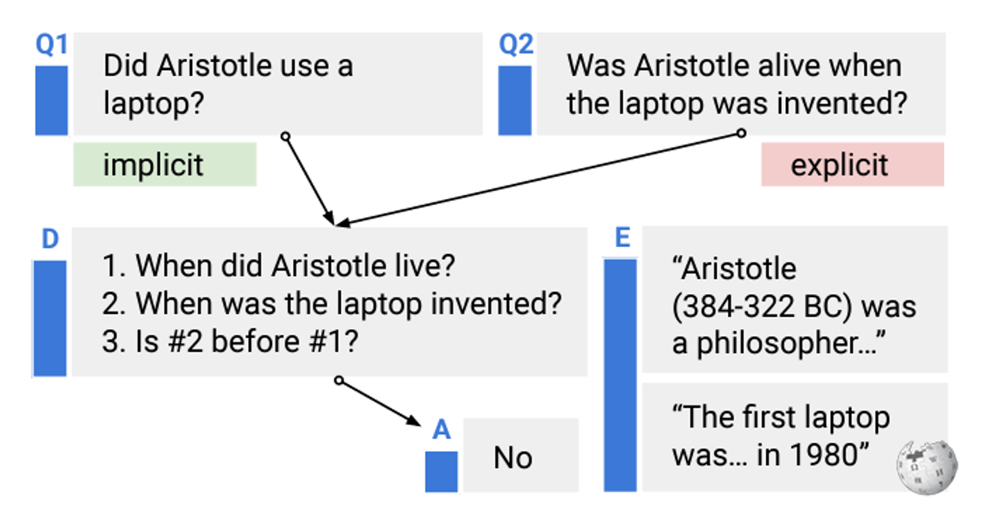
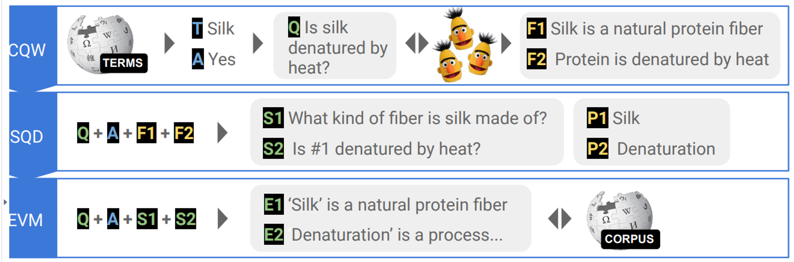
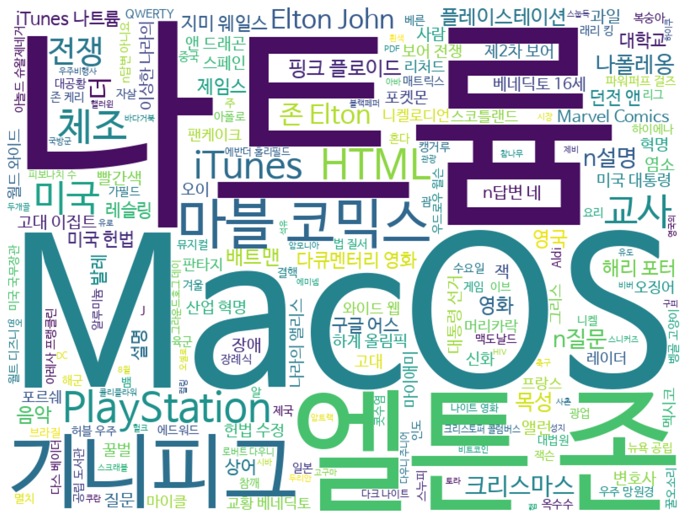

# Data_StrategyQA
StrategyQA 데이터 세트 번역


**Did Aristotle Use a Laptop? A Question Answering Benchmark with Implicit Reasoning Strategies**

https://github.com/eladsegal/strategyqa

데이터 개관

| 데이터 이름 | 내용 | 범주 | 도메인 | 입력 언어 | 출력 언어 |
| --- | --- | --- | --- | --- | --- |
| task169_strategyqa_sentence_generation | 특정 질문이 주어졌을 때 그 질문에 답하기 위해 알아야 할 사실을 기술 | [질의 응답] Misc. | 위키피디아 | 영어 | 영어 |

### 개요

 다단계 추론 질문 답변(QA) 벤치마크

- 암시적인 질문인 ‘아리스토텔레스는 노트북을 사용했는가’를 명시적인 질문인 ‘노트북이 발명되었을 때 아리스토텔레스는 살아있었는가’ 로 변형하는 작업. 이를 위해 정답을 도출하는 프로세스를 설명하는 데이터의 특성을 지님
- 1. 아리스토텔레스의 생몰년월, 2. 노트북이 발명된 시기, 3. 2는 1 이전에 일어난 사건인가? 와 같이 정답을 도출하는 프로세스를 명시적으로 설명하는 과정을 데이터에 포함함
- 위의 질문과 같은 전략적 질문에는 어떤 것이 있는지 확인하고 멀티 홉으로 분해하여 데이터를 구축
- QA 데이터 세트라고는 하나 대답은 ‘Yes/No’의 선택의문에 불과하여 기존의 질의응답 데이터 세트와는 구별된다.



## 주석자 편향 및 벤치마크 데이터로서의 난이도 조정을 위한 노력

생성 모델의 경우 주석자 편향을 극복하는 것이 데이터의 난이도를 결정하는 하나의 원인이 될 수 있는데 이 논문에서는 다음과 같이 데이터 수집 파이프라인을 구성하여 주석자 편향을 극복    

### 주석자의 작업 과정



(1) (CQW, §3.1) 작업자는 용어(T)와 예상 답변(A)을 제시받고 질문(Q)과 답변에 필요한 사실(F1,F2)을 작성        

(2) 질문은 작업자가 답을 찾을 것으로 예상되는 위키피디아 페이지의 타이틀(P1,P2)을 중심으로 단계(S1,S2)적으로 질문을 분해(SQD, §3.2)            

(3) (EVM, §3.3), 분해 단계에서 위키피디아에서 근거가 될만한 내용(E1, E2)과 일치하도록 구성    

### 모델을 통한 필터링

(1) 문제가 너무 쉬운지 확인하는 5개의 사전 학습된 모델(PTD라고 함)을 배포.  5개의 모델 중  4개 이상이 정답을 맞히면 그 문제는 필터링함             
(2) 수집된 데이터를 통해 지속적으로 미세조정하면서 현재 문제 세트의 편향성을 감지하기 위한 3개의 모델 세트(FNTD라고 함)를 사용. 3개의 솔버가 모두 정답을 맞히면 그 문제는 필터링함                

### 번역 유용성



- 위의 워드 클라우드 시각화에서 알 수 있는 것처럼 영어 특정적인 데이터라고 보기 어려워 한국어로 번역했을 때도 사용 가치가 높음        
- 사실 관계를 추적하는 추론 데이터로 영어뿐 아니라 한국어에서 필요한 과정임     

## 프롬프트 예시

```python
- Input article 전문 번역용 prompt

당신은 영어 글을 보고 한국어로 번역해주는 전문적인 번역가입니다.  
입력한 글은 전체 하나의 글을 문장 단위로 나누어 놓은 것입니다. 
하나의 글임을 염두하고 문장 단위로 최대한 자연스러운 표현으로 번역해 주세요. 생성 내용은 상식에 기반한 사실이어야 합니다.

# 제약 조건

- 주어진 내용 전체가 하나의 뉴스 기사이며 문장 단위로 줄바꿈 되어 있다.

- 입력한 글 내용을 모두 포함한다.

- 생성 내용은 상식에 기반한 사실이어야 한다.

- 최대한 자연스러운 한국어 표현으로 번역한다.

- 그 외 항목(output, explanation 등) 번역용 prompt

```

## 번역 예시

```
"Positive Examples": [
        {
            "input": "용어: 식용유, 설명: 식물이나 동물에서 유래하여 인간이 섭취하는 기름입니다. 질문: 모든 종류의 식용유를 따를 수 있나요? 답:아니오",
            "output": "일부 오일에는 코코넛 오일과 팜유와 같이 포화 지방이 함유되어 있습니다. 포화 지방은 실온에서 고체 상태입니다.",
            "explanation": "좋은 답변입니다. 이 질문에 답하기 위해서는 두 가지 사실을 모두 알아야 합니다."
        },
        {
            "input": "용어: 아리스토텔레스, 설명: 고대 그리스의 철학자, 질문: 아리스토텔레스는 노트북을 사용했나요?, 답변: 아니요",
            "output": "사실 1: 노트북은 1981년에 발명되었습니다.\n사실 2: 아리스토텔레스는 기원전 322년에 사망했습니다.",
            "explanation": "이 질문에 답하기 위해서는 노트북의 발명과 아리스토텔레스의 죽음에 대해 알아야 합니다. 따라서 이것은 좋은 답변입니다."
        }
    ],
    "Negative Examples": [
        {
            "input": "카슈프세 마을은 조지아의 압하지아 지역에 있는 가가리아 지구에 위치해 있습니다. 따라서 카슈프세는 조지아에 있습니다.",
            "output": "사실 1: 마을 카슈프세는 조지아 압하지아의 가가리아 지역에 위치해 있습니다.",
            "explanation": "설명에 있는 정보를 바탕으로 사실 항목을 작성해서는 안 됩니다."
        }
    ],
    "Instances": [
        {
            "id": "task169-cfb7a4ed048d47d583c015bc2ae5ed60",
            "input": "용어: 아트 데코(Art Deco), 설명: 1920년대 프랑스에서 처음 등장한 영향력 있는 시각 예술 디자인 스타일입니다. 질문: 아트 데코는 1990년대에 개최된 국제 장식 및 산업 박람회를 기반으로 한 것인가요? , 대답:아니오",
            "output": [
                "사실 1:아트 데코는 1925년 파리 박람회에서 이름을 따왔습니다. 사실 2: 르 코르뷔지에는 1925년에 아트 데코를 주제나 스타일로 언급하는 기사를 썼습니다. 사실 3: 르 코르뷔지에는 프랑스의 건축가였습니다."
            ]
```
원본 데이터 출처
```
@article{geva2021strategyqa,
  title = {{Did Aristotle Use a Laptop? A Question Answering Benchmark with Implicit Reasoning Strategies}},
  author = {Geva, Mor and Khashabi, Daniel and Segal, Elad and Khot, Tushar and Roth, Dan and Berant, Jonathan},
  journal = {Transactions of the Association for Computational Linguistics (TACL)},
  year = {2021},
}
```

**StrategyQA는 zero-shot으로 진행하여 사용한 예시 자료 없음. Few-shot 예시는 추후 자료에 적용 예정.**               
**데이터 세트에 대한 좀 더 자세한 사항은 https://blog.sionic.ai/articles 참고**        
**반복되는 번역 오류들은 사람의 수정을 거쳤으나 일부 남아있을 수 있음**         
**전체 데이터는 NAVER CLOUD PLATFORM의 Benefits를 사용하여 번역되었음**   
(https://guide.ncloud-docs.com/docs/clovastudio-copyright)
 


